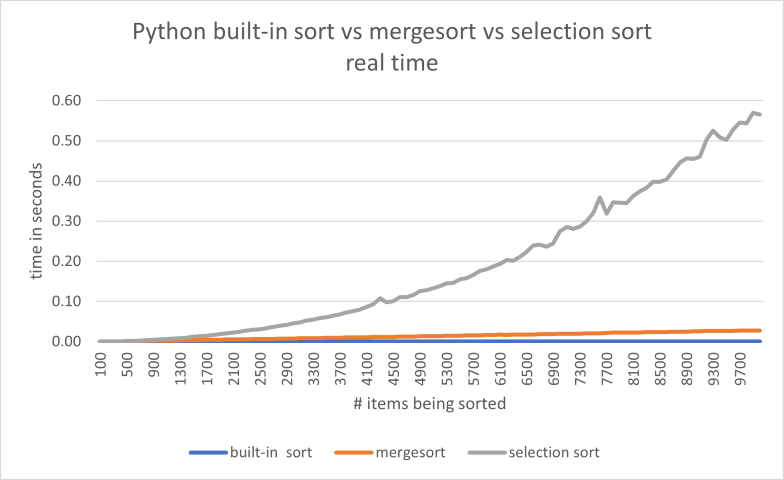

# Lecture 27 Notes

See [sorting.py](sorting.py) for the code used in these notes.

## The Basic Sorting Problem

Suppose you have a list of values $$a_0, a_1, \ldots, a_{n-1}$$. We assume all
they are all the same type, e.g. numbers, strings, letters, or lists --- *any*
value that can be compared with `<=`. The **sorting problem** asks for an answer
to this question:

> How can you re-arrange the values in the list so that they are in ascending
> order?

Python has a built-in sort function for lists that shows what this means:

```
>>> lst = [9, 3, 1, 4, 3]
>>> lst.sort()
>>> lst
[1, 3, 3, 4, 9]

>>> words = ['shell', 'nose', 'apple', 'tree', 'shoe']
>>> words.sort()
>>> words
['apple', 'nose', 'shell', 'shoe', 'tree']
```

Notice that the list is modified in-place, i.e. `sort` does *not* make a copy
and the original order of the list is lost. The algorithms we implement below
will, for simplicity, return a sorted copy.


### The Selection Sort Algorithm

Think for a moment how you would sort the numbers on this list:

```
[9, 3, 1, 4, 3]
```

One way to do it is like this:

- Pick out the smallest number, 1, and put it in a new list called `result`
- Pick out the next smallest number, 3, and append it to the end of `result`.
  There are two copies of 3, so do this once for each copy.
- Pick out the next smallest number, 4, and append it to the end of `result`.
- Finally, pick out the last number, 9, and append it to the end of `result`.

After these steps, `result` contains the numbers in sorted order.

This method of sorting is called **selection sort**, and we can implement it
like this in Python:

```python
def selection_sort(lst):
    result = []
    while len(lst) > 0:
        smallest = min(lst)
        result.append(smallest)
        lst.remove(smallest)
    return result
```

For example:

```
>>> selection_sort([9, 3, 1, 4, 3])
[1, 3, 3, 4, 9]

>>> selection_sort(['shell', 'nose', 'apple', 'tree', 'shoe'])
['apple', 'nose', 'shell', 'shoe', 'tree']
```


### The Mergesort Algorithm

Mergesort is a more efficient algorithm for sorting. In fact, Python's built-in
`sort` function is an optimized version of mergesort. 

The key idea of mergesort is to divide the list into two halves, sort each half
(recursively using mergesort!), and then *merge* the two sorted halves into a
single sorted list.

Here's how mergesort can be implemented in Python:

```python
import heapq

def merge(lst1, lst2):
    """Combines lst1 and lst2 into a new sorted list.
    lst1 and lst2 must both be in ascending sorted order.
    """
    return list(heapq.merge(lst1, lst2))   

def mergesort(lst):
    """Returns a copy of lst with its items re-arranged into ascending order.
    Uses mergesort.
    """
    n = len(lst)
    if n < 2:
        return lst[:]  # already sorted
    else:
        mid = n // 2
        left = lst[:mid]
        right = lst[mid:]
        left_sorted = mergesort(left)    # recursive call
        right_sorted = mergesort(right)  # recursive call
        return merge(left_sorted, right_sorted)
```

Start by reading the `mergesort` function. If the length of the list being
sorted is less than 2, then that list is already sorted and it returns the list
itself. For longer lists, it splits the list into two halves, recursively sorts
each half, and then merges the two haves together to form a new sorted list.

As you can guess from it's name, the `merge` function is an important part of
mergesort. Merging takes two *already-sorted* lists an combines them into a
single new sorted list. Since the lists are already sorted, it can do this much
more efficiently than sorting.

We uses Python's `heapq.merge` function to do the merging (see
[sorting.py](sorting.py) for another implementation of merge using loops and
if-statements). `heap.merge` doesn't return a list directly, but instead returns
the elements one at a time in sorted order. So we call `list` to get all the
elements in a list. It's similar `range(n)`, which returns the numbers 0 to n-1
one at a time, and you write `list(range(n))` if you want them all in a list.

Mergesort is **recursive**. That means that it calls itself in a couple of
places. Recursion can be a tricky topic to understand at first. We'll see more
examples of it later. For now, just know that a function can call itself, and
calling `mergesort` always returns a sorted list.


### Comparing Selection Sort and Mergesort

In practice, mergesort is much faster than selection sort. You can see it in
this graph of their running times (with the built-in sort included):



The graph shows that selection sort is *much* slower than both mergesort and
Python's built-in sort. The built-in sort is significantly faster than our
mergesort, which is reasonable given that the built-in sort was designed to be
extremely fast.

The selection sort graph is interesting. It's basic shape is a *parabola*, i.e.
a quadratic curve. While we won't go into the details here, the running time of
selection sort is proportional to $$n^2$$, where $$n$$ is the number of items
being sorted. Since $$n^2$$ is a quadratic expression, we say that selection
sort runs in **quadratic time**, i.e. the running time is proportional to the
*square* of the number of elements being sorted.

Notice that selection sort's graph is not smooth. It wiggles up and down a bit
because of randomness in the times. This is because the computer occasionally
does other things while running Python, e.g. it might receives email, save a
file in the background, be running a video, etc. These other operations can slow
down the sorting a little bit in ways that are hard to predict, but show up as
wiggles in the graph.

Mergesort (and the built-in sort) both run in time proportional to $$n \log_2
n$$, where $$n$$ is the number of items being sorted. When $$n$$ is large, this
is *much* less than $$n^2$$, and so mergesort is usually much faster than
selection sort. In practice, the performance is different that there are very
few cases where you would selection sort to mergesort. Indeed, in Python the
built-in sort is almost always the best choice.

See [comparisons.xlsx](comparisons.xlsx) for all the data.

### Example Application: Estimating Running Time

Knowing that *selection sort* runs in time proportional to $$n^2$$ can be
useful. For example, suppose it takes your computer 100 seconds to sort a big
list. About how long would you expect it to take to sort a list that is *twice*
as long? Think about this a moment before looking at the answer.

You might think that because it takes 100 seconds to sort 100 items, then it
should take 200 seconds to sort 200 items. But that's not true for selection
sort, since it's running time is proportional to $$n^2$$, *not* $$n$$. If it
takes $$n^2$$ seconds to sort $$n$$ items, then to sort $$2n$$ items it will
take $$((2n)^2) = 4n^2$$ seconds, i.e. four times as long as sorting n items.

So the answer to the original question is that it would take 400 seconds to sort
$$2n$$ items.

What if we had three times as much data to sort, i.e. $$3n$$ items on the list?
It takes 100 seconds to sort $$n$$ items, and that is proportional to $$n^2$$.
Sorting $$3n$$ items will then take $$(3n)^2 = 9n^2$$ seconds, i.e. *nine* times
as long as sorting $$n$$ items. So it would take 900 seconds to sort $$3n$$
items.
